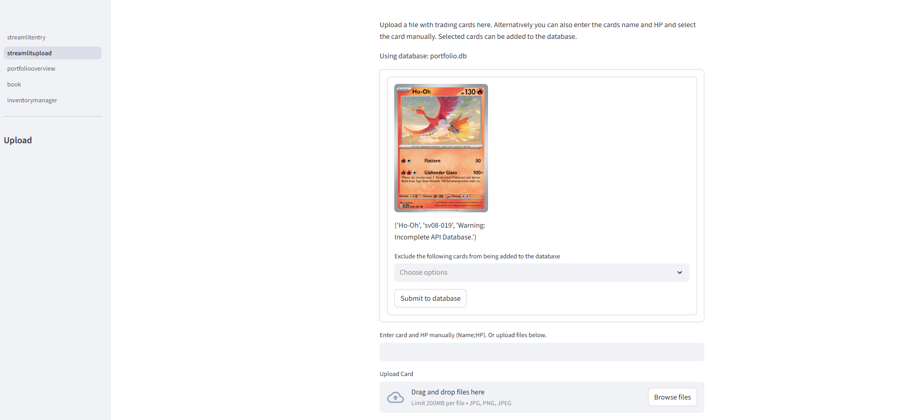
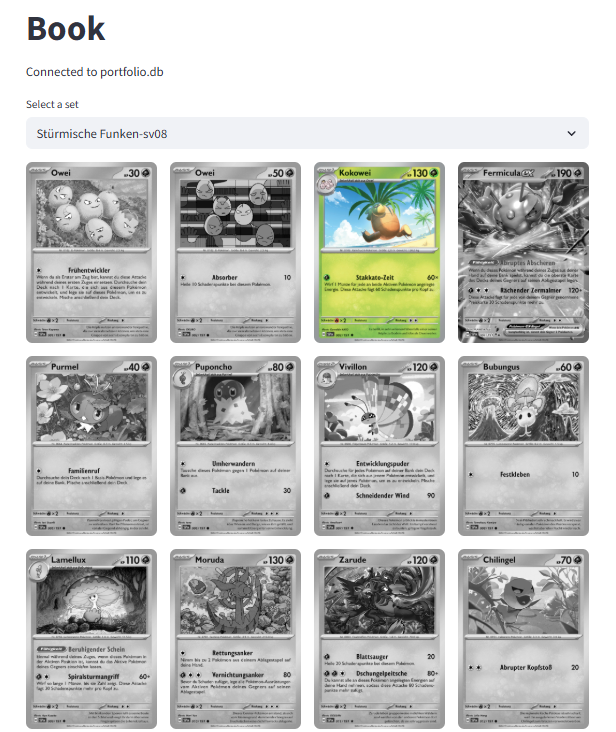
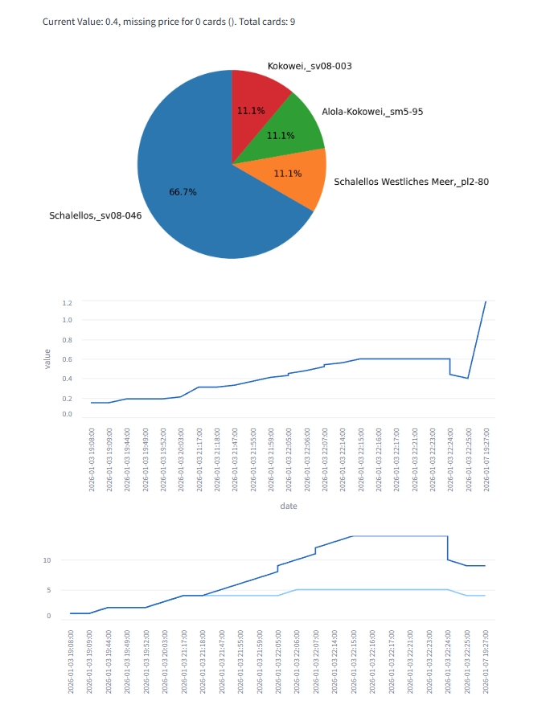

# Pokémon Card Scanner

A Pokémon Card Scanner that detects and identifies Pokémon cards using image processing and a finetuned RFDETR model.  
The project is designed to scan cards via images or the provided name and return relevant card information by querying a REST-API (https://tcgdex.dev/)

---

## 📌 Features

- Scan Pokémon cards from images
- Card recognition and using image processing
- Card matching using template matching
- Organized dataset handling
- Card information lookup
- Inventory manager

---

## 📷 Showcase

Upload your image here. When uploading multiple images you can choose which cards should be added to the database in case some are misclassified.

Personal collection page. Cards in collection are displayed in color while missing cards are displayed as grayscale images. 

Information about your entire collection such as unique cards, total cards and current value. 